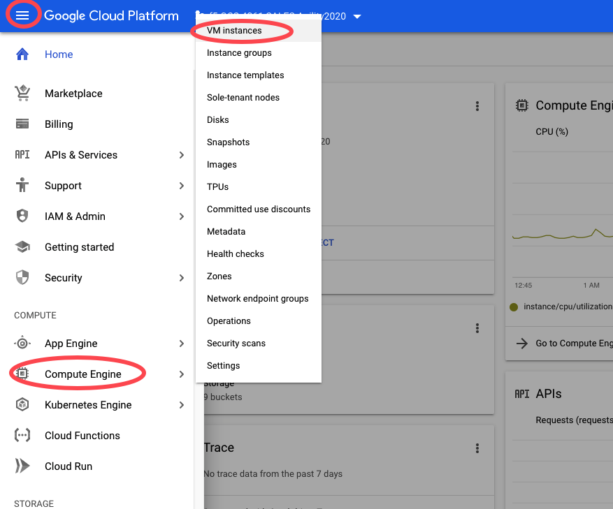
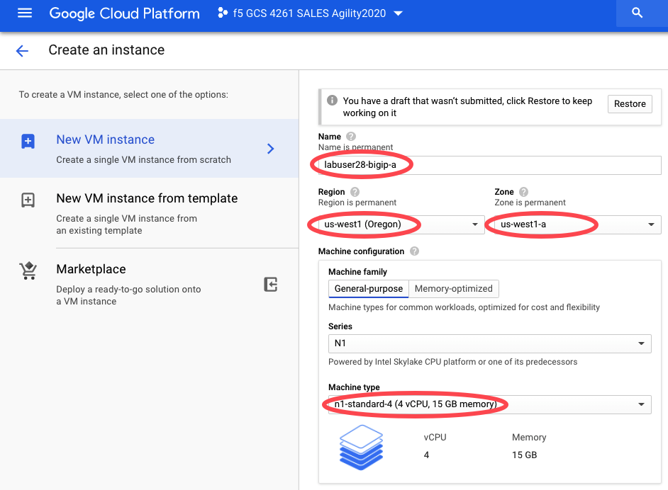
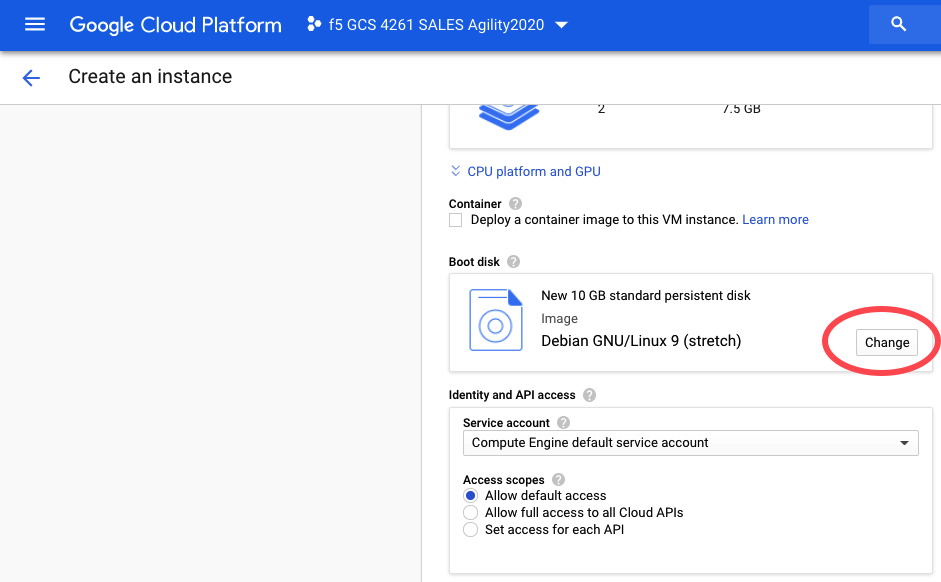
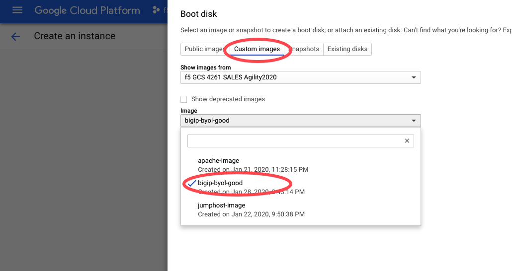
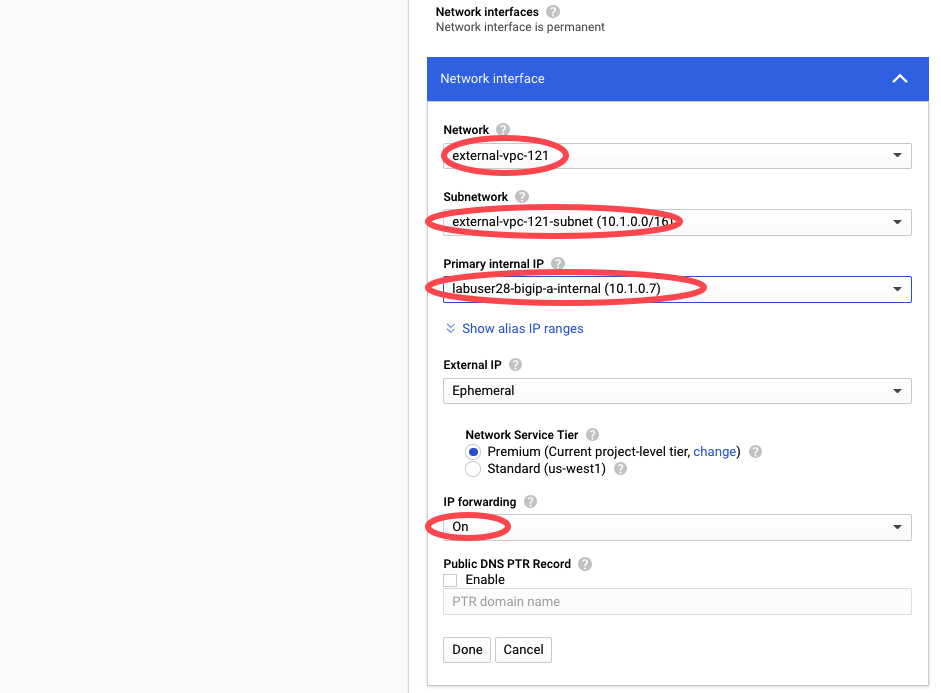
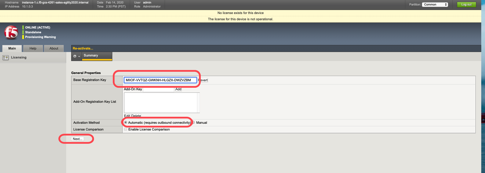
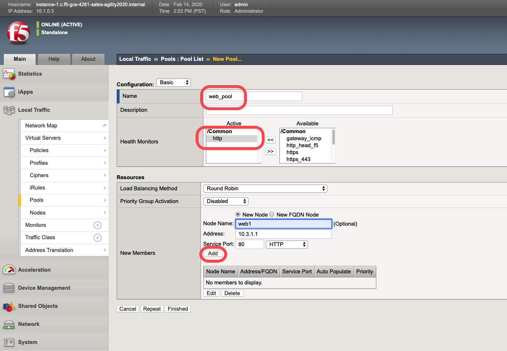
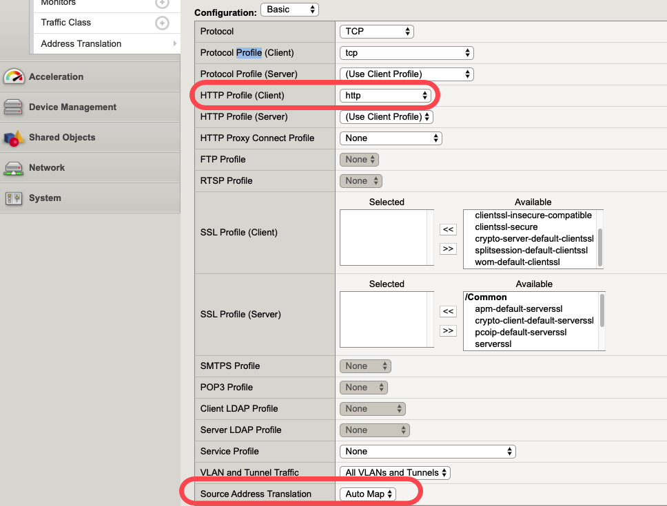
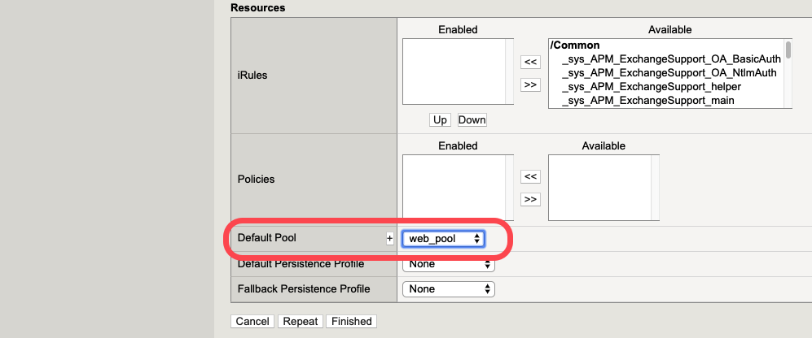

Task 1: Deploy BIGIP-A using Google Cloud Console
==================================================

In this lab we will deploy only **BIGIP-A** using configuration utility (webUI). Below is the summary steps you will be taking to deploy BIG-IP in GCP.
When completed, you should be able to send traffic to your application servers through BIG-IP VE.

Summary
-------------

1.	Deploy BIG-IP VE from GCP's Marketplace
2.	Setup initial configuration on BIGIP VE
3.  Create a pool and a virtual server

Step1 - Deploy BIG-IP VE from GCP's Marketplace
-----------------------------------------
1.1 Login to Google Cloud Console at https://console.cloud.google.com using provided credentials

1.2 In the Google Cloud Console, in the top left corner, click the Navigation menu icon. Choose **COMPUTE->Compute Engine->VM instances**.

1.3 Click **CREATE INSTANCE**. Enter the following information and leave the rest as default.

For **Name, Region and Zone**:

| Field | Value |
| ---| --- |
| Name | labuserX-bigip-a (e.g. labuser29-bigip-a)|
| Region | us-west1 (Oregon) |
| Zone | us-west1-a |

For **Machine configuration** setting. From the dropdown menu.
| Field | Value |
| ---| --- |
| Machine type | n1-standard-4 |

For **Boot disk** setting. Click **Change** button.  

Go to **Custom images** tab. Choose the pre-loaded image named **bigip-byol-good**.

Expand **Management, security, disks, networking, sole tenancy** setting. Go to **Networking** tab, under **Network interfaces**.

| Field | Value |
| ---| --- |
| Network | external-vpc-121 |
| Subnetwork | external-vpc-121-subnet (10.1.0.0/16) |
| Primary internal IP | Reserve Custom IP address 10.1.1.x (e.g. 10.1.1.29)
| IP Forwarding | On |

1.6 Click ** Create**. It will take **at least 10 minutes** for the BIG-IP to boot up before you can SSH into it.

Step2 - Setup initial configuration on BIG-IP
----------------------------------------------
In this single_NIC setup, all access to the BIG-IP VE is through the same IP address and virtual network interface (vNIC). When you first boot BIG-IP VE, the system automatically creates networking objects (vNIC 1.0, an internal VLAN, and an internal self IP address) for you, and sets the port for the BIG-IP Configuration utility to 8443.

The first time you boot BIG-IP VE, you must connect to the instance and create a strong admin password. You will use the admin account and password to access the BIG-IP Configuration utility.

This management interface may be accessible to the Internet, so the password must be strong.

2.1 RDP to window jumphost at 35.197.78.160 using provided credentials. Once logged in to RDP, use **PuTTY** from the desktop to connect to the BIGIP-A instance as admin (e.g. 10.1.1.29)

2.2 Use an SSH tool to connect to the BIG-IP VE instance as admin.

``modify auth password admin``

2.3 Type the new password **LabuserX@gcp121 (e.g. Labuser29@gcp121)** and press Enter. The terminal screen displays the message:

``changing password for admin``

``new password:``

2.4 Type the new password and press Enter. The terminal screen displays the message:

``confirm password``

2.5 Change the hostname to **labuserX-bigip-a.agility20.com** . For example **labuser29-bigip-a.agility20.com**

``modify sys global-settings hostname labuser29-bigip-a.agility20.com``

2.7 Ensure that the system retains the changes:

``save sys config``

2.8 Open a web browser and log in to the BIGIP Configuration utility by using the external IP address and port 8443.
    For example: **https://10.1.1.x:8443 (e.g. 10.1.1.29:8443)**.
    The username is admin and the password is the one you set previously.

2.9 Click **Activate** and license the BIG-IP with one of the evaluation keys provided to you.

2.10 Choose **Resource Provisioning** screen. Default is fine. Click submit.

Step3 - Create a pool and a virtual server
------------------------------------------------

3.1 In BIG-IP Configuration utility, for example: **https://10.1.1.x:8443 (e.g. 10.1.1.29:8443)**.

3.2 Create a pool with two members. On the Main tab, click **Local Traffic -> Pools**. Click **Create** per below.

| Field | Value |
| --- | --- |
| Name  | web_pool |
| Health Monitors | http |
| Node Name | web1, web2 |
| Address | 10.3.1.1, 10.3.2.1 |
| Service Port | 80 |

3.3 In the **Name** field, type **web-pool**. Two backend web servers are pre-configured in the GCP environment.

3.4 Verify all pool members are healthy **Local Traffic -> Pools:Pool List ->web_pool -> Members**.

3.5  Now we will create a virtual server that listens for packets destined for BIGIP's IP address.
     In BIG-IP Configuration utility, **Local Traffic -> Virtual Servers**. Click **Create**.

| Field | Value |
| --- | --- |
| Name | vs_web |
| Destination Address/Mask | 10.1.1.x/16 |
| Service Port | 80 |
| HTTP Profile | http |
| Source Address Translation | Auto Map |
| Default Pool | web_pool |

3.6 You can test the application now. Open a browser **http://10.1.1.x**.
You should see a webpage with **Web Server 1!** or **Web Server 2!**.

Task 1 is completed here :)
--------------------------
