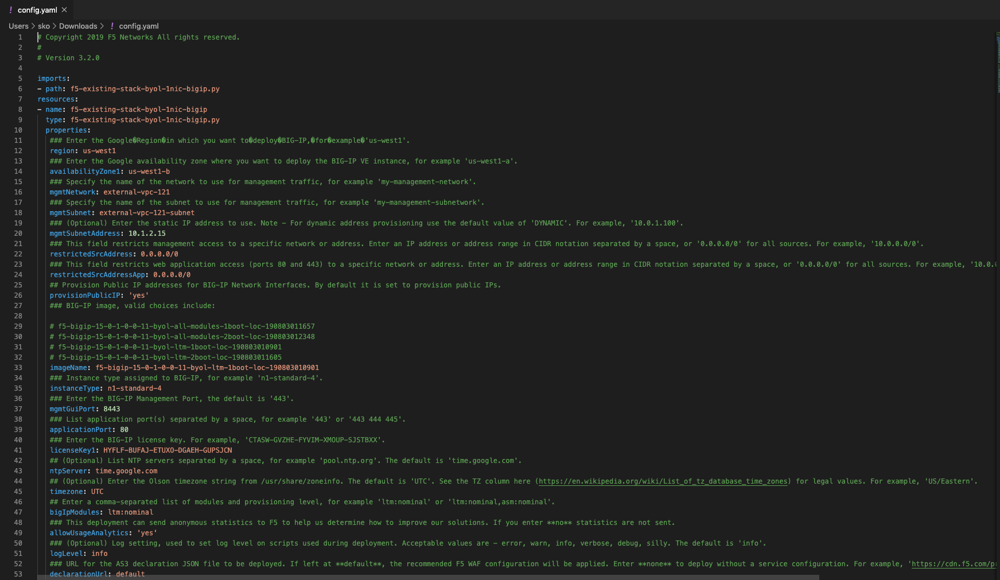
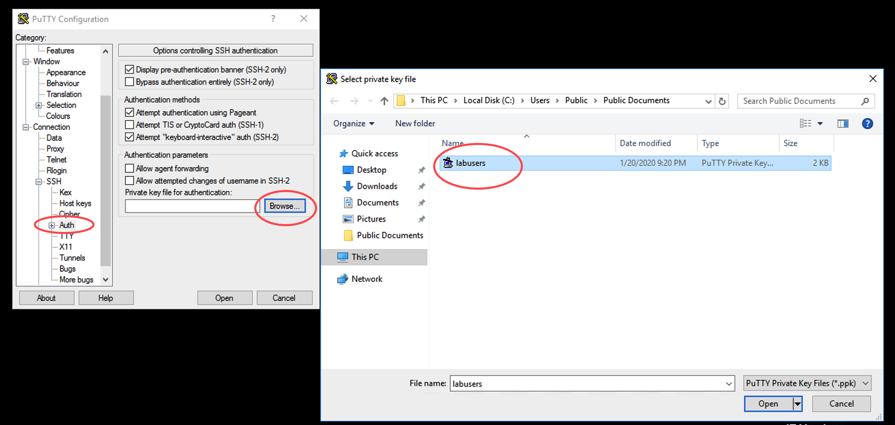
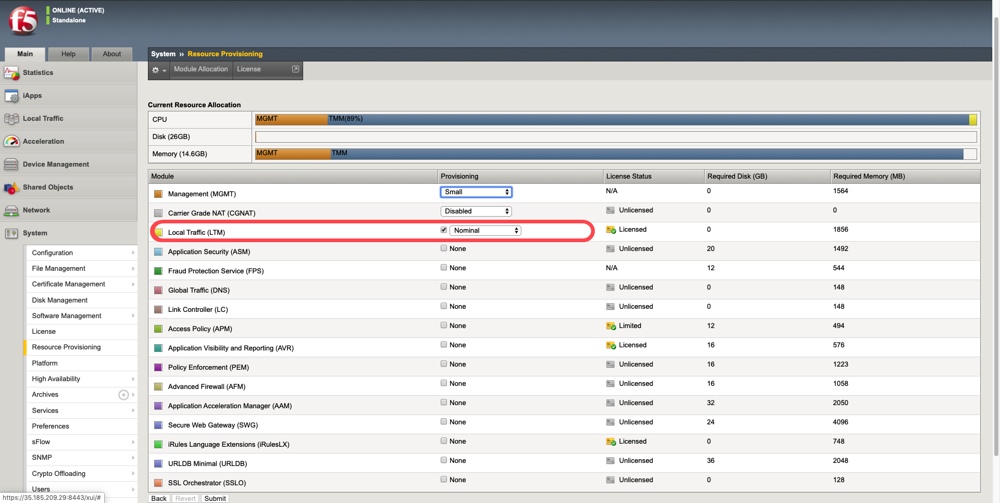
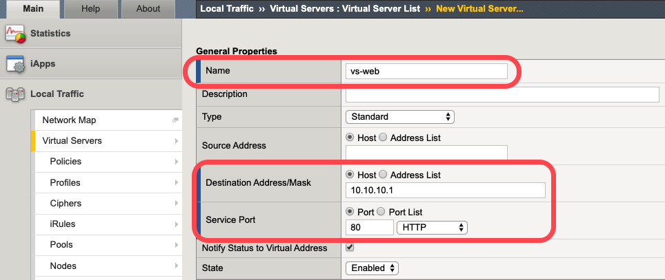

Task 2: Deploy BIGIP-B using Google Deployment Manager (GDM) templates
================================================================
In this lab we will deploy **BIGIP-B** using Google Deployment Manager template. Below is the summary steps you will be taking to deploy BIG-IP in GCP.
When completed, you should be able to send traffic to your application servers through BIG-IP VE.

All F5 supported GDM templates can be found at https://github.com/F5Networks/f5-google-gdm-templates. In this lab, we will be using **1nic BYOL** template.

Summary steps
-------------

1.	Download and prepare the GDM template
2.	Setup initial configuration on BIGIP-B
3.  Create a pool and a virtual server

Step1 - Download and prepare the GDM template
---------------------------------------------

1.1 RDP to window jumphost at 35.197.78.160 using provided credentials.

1.2 All the templates are pre-cloned to the window jumphost. We will use **1nic standalone byol** template for this lab.
    The  1nic template file can be found at **C:\Users\labuserX\f5-google-gdm-templates\supported\standalone\1nic\existing-stack\byol**

1.3 Open Visual Studio Code program from the desktop, to view/edit the YAML file. **File->Open folder** to C:\Users\labuserX\f5-google-gdm-templates\supported\standalone\1nic\existing-stack\byol

1.4 You should see python, schema and yaml files. YAML file contains the parameters necessary to deploy the BIG-IP instance in Google Cloud, and calls the python script to launch the instance. Open **f5-existing-stack-byol-1nic-bigip.yaml** file to review. All the editing work will be done in this YAML file.

1.5 Edit the parameters in the YAML file  as described below. Don't forget to **Save** the file.

| Parameters | Value |
| --- | --- |
| region | us-west2 |
| availabilityZone1 | us-west2-a |
| mgmtNetwork | external-vpc-121 |
| mgmtSubnet | external-vpc-121-subnet |
| mgmtSubnetAddress | 10.1.1.x  |
| restrictedSrcAddress | 0.0.0.0/0 |
| restrictedSrcAddressApp | 0.0.0.0/0 |
| provisionPublicIP | yes |
| imageName | f5-bigip-15-0-1-0-0-11-byol-ltm-1boot-loc-190803010901 |
| instanceType | n1-standard-4 |
| mgmtGuiPort | 8443|
| applicationPort | 80 |
| licenseKey1 | Use provided eval key here |
| ntpServer | time.google.com |
| timezone | UTC |
| bigIpModules | ltm:nominal |
| allowUsageAnalytics | yes |
| logLevel | info |
| declarationUrl | default |

1.6 No action needed on this step. Google cloud SDK(gcloud) is already pre-installed and initialized on the window jumphost. You can review how-to documents below later.

    https://cloud.google.com/sdk/install

    https://cloud.google.com/sdk/docs/initializing

1.7 Open the command prompt from the Desktop. Change the directory to where the 1nic template files are.

``cd C:\Users\labuserX\f5-google-gdm-templates\supported\standalone\1nic\existing-stack\byol``

1.8 Now we are ready to deploy the template file with gcloud. Run the command.

This is the gcloud syntax:

``gcloud deployment-manager deployments create <name of deployment> --config <name of yaml file> --description <description>``

| Parameters | Value |
| --- | --- |
| name of deployment | labuserX-bigip-b |
| name of yaml file | f5-existing-stack-byol-1nic-bigip.yaml |
| description | labuserX-deployment |

Once the deployment is successfully completed. you will see something like below. it will take **at least 10 minutes** for the BIG-IP to boot up before you can SSH into it.

NOTE: If the deployment fails you should delete, fix the yaml file and re-create the deployment.

``gcloud deployment-manager deployments delete labuserX-deployment``

1.9 After you run the template create it will take **at least 10 minutes** for the BigIP to come up before you can SSH into it.

Step2 - Setup initial configuration of BIG-IP
---------------------------------------------

2.1 From the window jumphost, use **PuTTY** to connect to the BIGIP-B instance at **10.1.2.X**.
Point to the private key for authentication. The private key file is at **Public Documents\labusers**

2.2 Login with default username **admin**. To ensure you are at the tmsh command prompt, type **tmsh**.

``modify auth password admin``

2.3 Type the new password **LabuserX@gcp121** and press Enter. The terminal screen displays the message:

``changing password for admin``
`` new password:``

2.4 Type the new password and press Enter. The terminal screen displays the message:

``confirm password``

2.5 Change the hostname to **labuserX-bigip-b.agility20.com** . For example **labuser29-bigip-b.agility20.com**

``modify sys global-settings hostname labuser29-bigip-b.agility20.com``

2.7 Ensure that the system retains the changes:

``save sys config``

2.8 Open a web browser and log in to the BIGIP-B configuration utility by using port 8443.
    For example: **https://10.1.2.x:8443**.
    The username is admin and the password is the one you set previously.

2.9 Click **Activate** and license the BIGIP-B with one of the evaluation keys provided to you.

2.10 Choose **Resource Provisioning** screen. Default is fine. Click submit.

Step3 - Create a pool and a virtual server
------------------------------------------------

3.1 In BIG-IP Configuration utility, for example: **https://10.2.1.X:8443**.

3.2 Create a pool with two members. On the Main tab, click **Local Traffic -> Pools**. Click **Create** per below.

| Field | Value |
| ---| --- |
| Name | web_pool |
| Health Monitors | http |
| Node Name | web1, web2 |
| Address |  10.3.1.1, 10.3.2.1 |
| Service Port | 80 |

3.3 In the **Name** field, type **web_pool**. Names must begin with a letter, be fewer than 63 characters, and can contain only letters, numbers, and the underscore (_) character.

3.4 Verify all pool members are healthy **Local Traffic -> Pools:Pool List ->web_pool -> Members**.

3.5  Now we will create a virtual server that listens for packets destined for BIGIP's IP address.
     In BIG-IP configuration utility, **Local Traffic -> Virtual Servers**. Click **Create**.

| Field | Value |
| --- | --- |
| Name | vs_web |
| Destination Address/Mask | 10.2.1.X/16 |
| Service Port | 80 |
| HTTP Profile | http |
| Source Address Translation | Auto Map |
| Default Pool | web_pool |

3.6 You can test the application now. Open a browser **http://10.1.1.x**.
You should see a webpage with **Web Server 1!** or **Web Server 2!**.

Task 2 is completed here :)
--------------------------
